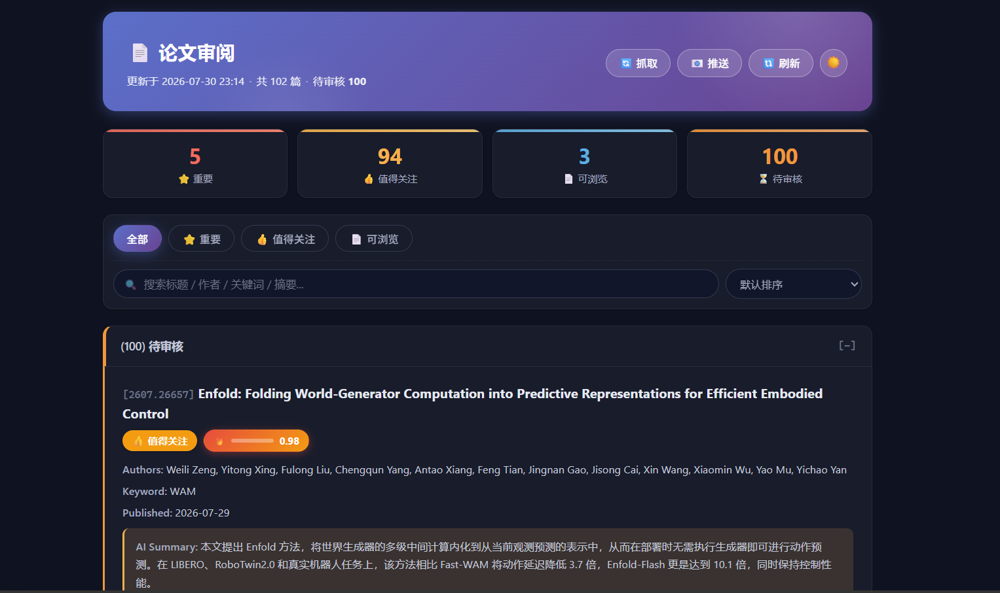

# Paper Research — 论文自动调研工具

定时增量抓取 **Arxiv** 预印本，调用 **LLM**（Deepseek）自动评分初筛，提供 **Web 交互审阅**，并可将选中的论文导入 **Zotero**（指定收藏夹 + 短标题）。

---

## 界面预览
</centering>
<div>

<p> Web 审阅主界面：论文列表按 LLM 评分排序，支持筛选、搜索、一键导入 Zotero </p>
</div>

---

## 核心流程

```
定时/手动抓取
  → Arxiv API（仅元数据，不下载 PDF）
  → LLM 评分（important / useful / browse / skip）
  → SQLite 数据库存储
  → Web 审阅页面
  → 审阅决策：
    ├── 忽略（不入 Zotero）
    ├── 延后（放入 Lurk 区）
    └── 导入 Zotero（指定收藏夹 + 短标题 + AI Summary 子笔记）
```

## 快速开始

### 1. 安装

```bash
# 克隆仓库
git clone https://github.com/He-JiYe/paper-research.git
cd paper-research

# 创建虚拟环境（需先安装 uv：pip install uv）
uv venv .venv

# 安装依赖
uv sync
```

> 💡 也可以不手动激活虚拟环境，直接使用 `uv run` 命令，它会自动识别虚拟环境。

### 2. 配置

复制示例配置并填写：

```bash
cp config/config.example.yaml config/config.yaml
```

**安全建议**：所有密钥支持 `${ENV_VAR}` 占位符，优先用环境变量，避免明文落盘：

```powershell
setx DEEPSEEK_API_KEY "sk-xxxx"
setx ZOTERO_API_KEY "xxxx"
setx ZOTERO_LIBRARY_ID "12345678"
setx EMAIL_PASSWORD "smtp-auth-code"   # QQ 邮箱 SMTP 授权码（非 QQ 密码）
```

> ⚠️ `config/config.yaml` 已加入 `.gitignore`，不会被提交。请勿将其移出忽略列表。

主要配置项（`config/config.yaml`）：

| 字段 | 说明 |
|------|------|
| `keywords` | 搜索关键词列表：`keyword` / `arxiv_cats`（限定分类）/ `active` |
| `fetch.lookback_days` | 增量抓取回溯天数（建议 3） |
| `fetch.max_results` | 每个关键词最大结果数 |
| `scheduler.fetch_time` | 每日定时抓取时间（内置调度器，如 `"08:30"`） |
| `scheduler.catch_up_on_start` | serve 启动时若今日错过抓取则自动补抓 |
| `notification.email` | 邮件通知（抓取完成 + 新论文时推送） |
| `zotero` | Zotero API 配置（api_key / library_id / library_type） |

### 3. 首次抓取

```bash
uv run paper-research fetch              # 增量抓取（lookback_days 窗口）+ LLM 评分 + 生成 HTML
uv run paper-research fetch -m historical # 历史抓取（不限时间，按相关性排序）
uv run paper-research fetch --dry-run    # 预览模式，不写入数据库
```

### 4. 打开 Web 审阅

```bash
uv run paper-research serve
```

浏览器自动打开 `http://127.0.0.1:8899`。serve 启动后：

- 内置调度器每天 `scheduler.fetch_time` 自动增量抓取
- 若启动时今天已过抓取时间但尚未抓取，自动补抓一次
- 有新论文时自动发送邮件通知

### 5. 审阅与导入 Zotero

| 操作 | 效果 |
|------|------|
| 🗑️ 忽略 | 仅更新 DB 状态，不入 Zotero |
| ⏳ 延后 | 放入 Lurk 区 |
| ⏳ 待审核 | 取消标记，放回待审阅 |
| 📚 Zotero | 导入 Zotero：`Paper Research/Inbox` + 关键词子收藏夹 + 指定收藏夹，设置短标题，附 AI Summary 子笔记 |

---

## 命令参考

```bash
uv run paper-research fetch              # 增量抓取 + LLM 评分 + 写入 DB + 生成 HTML
uv run paper-research fetch -k <keyword> # 仅抓取指定关键词
uv run paper-research fetch -n 30        # 覆盖每关键词最大结果数
uv run paper-research fetch --dry-run    # 预览模式
uv run paper-research serve              # 启动 Web 审阅服务（含内置调度器）
uv run paper-research status             # 统计仪表盘（DB + Zotero + 抓取日志）
uv run paper-research notify             # 手动发送通知邮件
```

Web API（serve 运行时）：

| 端点 | 说明 |
|------|------|
| `GET /` | 审阅首页 |
| `POST /mark` | 标记论文（ignore/lurk/pending） |
| `POST /api/zotero/import` | 导入论文到 Zotero |
| `GET /api/zotero/collections` | Zotero 收藏夹列表 |
| `POST /api/fetch` `/api/keyword-fetch` | 触发抓取（后台执行） |
| `POST /api/search-preview` `/api/search-import` | 交互式搜索与导入 |
| `GET /api/scheduler/status` | 调度器状态（上次/下次抓取时间） |
| `GET /api/pdf/{arxiv_id}` | 重定向到 arxiv PDF |
| `POST /api/push` | 手动发送邮件通知 |

---

## 持续化部署（本地）

项目自带 `scripts/register_task.ps1`（Windows 任务计划注册脚本）：

```powershell
# 开机登录后自动后台启动 serve（内置调度器每天定时抓取）——推荐
.\scripts\register_task.ps1 -Mode startup

# 或：每天 08:30 定时执行一次 fetch（不常驻 serve）
.\scripts\register_task.ps1 -Mode daily -Time "08:30"

# 查看 / 立即运行 / 卸载
.\scripts\register_task.ps1 -Action status
.\scripts\register_task.ps1 -Action run-now
.\scripts\register_task.ps1 -Action unregister
```

---

## 项目结构

```
paper-research/
├── config/
│   ├── config.yaml          # 实际配置（含密钥，已 gitignore）
│   └── config.example.yaml  # 配置模板（可提交）
├── data/                    # SQLite 运行时数据库（papers.db）
├── output/                  # 生成产物（HTML 摘要页、日志）
├── static/                  # 前端静态资源
├── templates/               # Jinja2 模板（summary.html）
├── scripts/                 # 部署脚本（register_task.ps1）
├── src/
│   ├── main.py              # CLI 入口（argparse）
│   ├── commands.py          # CLI 命令实现
│   ├── config.py            # 配置加载（AppConfig + ${ENV_VAR} 占位符）
│   ├── db.py                # SQLite 数据库层（PaperDB，WAL，线程安全）
│   ├── scorer.py            # PaperScorer（LLM 评分 + 无 Key 时关键词 fallback）
│   ├── notify.py            # SMTP 邮件通知
│   ├── network/
│   │   ├── base.py          # 数据源抽象基类
│   │   ├── arxiv.py         # Arxiv API（基于 arxiv 库）
│   │   ├── factory.py       # 数据源工厂（可扩展 pubmed 等）
│   │   └── fetch_pipeline.py# 抓取管道（抓取→评分→入库→HTML→日志）
│   ├── serve/
│   │   ├── server.py        # FastAPI Web 服务
│   │   ├── renderer.py      # Jinja2 渲染（autoescape 防 XSS）
│   │   └── scheduler.py     # 内置定时调度器（时区感知 + 启动补抓）
│   └── zotero/
│       ├── client.py        # Zotero API 客户端（pyzotero 封装）
│       └── models.py        # 标签常量、Extra 编解码、数据转换
└── tests/                   # pytest 测试套件
```

---

## 开发

```bash
uv sync --dev                  # 同步开发依赖
uv run ruff check              # 代码检查
uv run ruff format             # 格式化
uv run pytest                  # 全部测试
uv run pytest --cov=src        # 带覆盖率
```

## 技术栈

| 组件 | 技术 |
|------|------|
| 语言 | Python 3.11+（uv 管理） |
| Web 框架 | FastAPI + Jinja2 |
| 数据库 | SQLite（WAL 模式） |
| Arxiv | arxiv 官方库 |
| LLM | Deepseek API（OpenAI SDK） |
| Zotero | pyzotero |
| 测试 | pytest + coverage |

---

## 安全说明

- **密钥管理**：`config/config.yaml` 已 gitignore；推荐 `${ENV_VAR}` 占位符从环境变量读取
- **XSS 防护**：Jinja2 已开启 autoescape，论文标题/摘要/LLM 输出自动转义
- **输入校验**：`/api/pdf/{arxiv_id}` 校验 ID 格式
- **绑定地址**：server 默认仅监听 `127.0.0.1`，不要改为 `0.0.0.0`
- **Arxiv 限流**：`max_concurrent_requests` 建议 ≤ 3（官方建议 1 请求/3 秒）
- **无 API Key 降级**：LLM 不可用时自动使用关键词规则评分（精度较低）

## 未来开发计划

- 扩展数据源：从 Arxiv 扩展到多个免费数据库（PubMed / DBLP 等，BaseSource 已预留接口）
- 笔记能力：PDF 解析生成结构化阅读笔记，接入 Obsidian
- 综述生成：review agent 按关键词聚合已有论文生成综述
